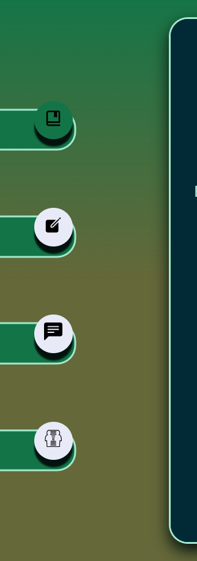

# DND APP
## Web application built for DND DMs
This first iteration will provide basic tools for NPC generation and administration.

## Tools in use
The application is built on the React.js framework.

## Color palette
### CSS HEX
- --dark-moss-green: #656839ff; 
- --aquamarine: #a1e8ccff;
- --dark-purple: #370926ff;
- --gunmetal: #012a36ff;
- --dark-spring-green: #137547ff;

# Functions
## Move between pages
The buttons on the left allow for quick movement between pages:

## Consult
The first page displays a simple menu with the queried data from https://www.dnd5eapi.co/api/.
By clicking on the buttons from the menu, you can change filters, and find results.
(Currently only displaying information as JSON data)

| Before Filter | After Filter | 
|--:|---|
|   |   |   
